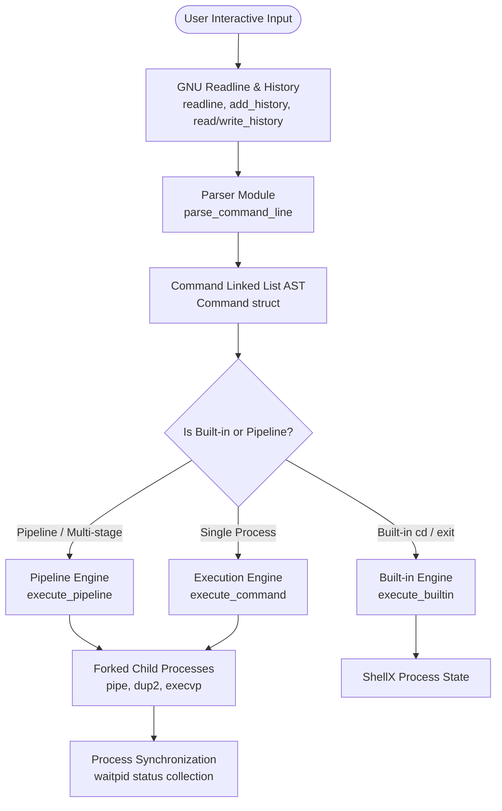

# ShellX

A lightweight, POSIX-compliant UNIX shell written in modern C17, designed as an educational model for UNIX systems programming, process management, inter-process communication (IPC), and I/O redirection.

[](https://en.cppreference.com/w/c/17)
[](https://www.kernel.org)
[](https://pubs.opengroup.org/onlinepubs/9699919799/)
[](Makefile)
[](LICENSE)
[](#roadmap)

---

## Overview

**ShellX** is a minimalist UNIX shell implementation focused on foundational systems programming concepts. It serves as an architectural blueprint for understanding process management, memory safety, lexical tokenization, file descriptor manipulation, and pipeline synchronization.

### Why ShellX Exists
Modern shells like `bash` and `zsh` consist of hundreds of thousands of lines of legacy code, making them difficult to study for core operating system mechanisms. **ShellX** strips away complex interactive features (e.g., alias expansion, parameter expansion) to highlight clean, unadorned UNIX kernel primitives (`fork`, `execvp`, `pipe`, `dup2`, `waitpid`).

### Primary Objectives
- **Systems Programming Rigor**: Showcase strict C17 standards compliance (`-std=c17 -Wall -Wextra -Wpedantic`), robust memory handling, and explicit error checking.
- **IPC & Process Architecture**: Provide a clear implementation of arbitrary-length IPC pipelines using standard file descriptor chaining.
- **Educational Clarity**: Maintain clean module separation between lexical parsing, pipeline AST abstraction, built-in command handling, and process execution.

---

## Features

The feature matrix below details the current implementation state of **ShellX**.

| Feature | Status | Implementation Details |
| :--- | :---: | :--- |
| **Command Parsing** | ✔ Implemented | Custom whitespace tokenizer & AST builder separating syntax parsing from execution. |
| **Built-in Commands** | ✔ Implemented | In-process execution for core built-ins (`cd` with `HOME` fallback, `exit`). |
| **Arbitrary Pipelines** | ✔ Implemented | Multi-stage pipeline execution (`cmd1 \| cmd2 \| ... \| cmdN`) via `pipe()` and `dup2()`. |
| **Input Redirection** | ✔ Implemented | File input redirection using `<` operator (`O_RDONLY`). |
| **Output Redirection** | ✔ Implemented | File output truncation redirection using `>` operator (`O_WRONLY \| O_CREAT \| O_TRUNC`). |
| **Append Redirection** | ✔ Implemented | File output append redirection using `>>` operator (`O_WRONLY \| O_CREAT \| O_APPEND`). |
| **Automated Test Suite** | ✔ Implemented | Comprehensive unit test suite covering parser, executor, built-in, and pipeline modules. |
| **GNU Readline / Line Editing** | ✔ Implemented | Interactive prompt (`ShellX$ `), arrow key line editing, and `Ctrl+D` EOF handling (`v0.2.0`). |
| **Persistent History** | ✔ Implemented | History persistence across shell sessions stored in `~/.shellx_history` with duplicate filtering (`v0.2.0`). |
| **Background Execution (`&`)** | ✔ Implemented | Asynchronous background execution (`cmd &`, `cmd1 \| cmd2 &`) displaying `[job_id] <pid>` (`v0.3.0-alpha`). |
| **POSIX Job Control (`fg`/`bg`)** | ❌ Planned | Scheduled for milestone `v0.3.0`. |

> [!NOTE]
> Asynchronous background command execution (`&`) launches processes without waiting for completion and immediately redisplays the shell prompt. Full POSIX job control (`jobs`, `fg`, `bg`), process group management (`setpgid`), and `SIGCHLD` signal handler zombie reaping will be added in the upcoming job control milestone.

---

## Architecture

ShellX follows a modular compilation architecture where execution flow is divided into four main layers:



### Module Responsibilities
- [include/shell.h](file:///wsl.localhost/Ubuntu/home/rakshaad/projects/ShellX/include/shell.h) & [src/main.c](file:///wsl.localhost/Ubuntu/home/rakshaad/projects/ShellX/src/main.c): Interactive REPL entry point managing GNU Readline input loop, prompt rendering (`ShellX$ `), persistent history loading/saving (`~/.shellx_history`), and `Ctrl+D` EOF handling.
- [include/parser.h](file:///wsl.localhost/Ubuntu/home/rakshaad/projects/ShellX/include/parser.h) & [src/parser.c](file:///wsl.localhost/Ubuntu/home/rakshaad/projects/ShellX/src/parser.c): Tokenizes input line into null-terminated argument arrays and builds a linked list of `Command` structures.
- [include/pipeline.h](file:///wsl.localhost/Ubuntu/home/rakshaad/projects/ShellX/include/pipeline.h) & [src/pipeline.c](file:///wsl.localhost/Ubuntu/home/rakshaad/projects/ShellX/src/pipeline.c): Manages iterative pipe descriptor creation, child process spawns, descriptor inheritance, and exit status collection.
- [include/executor.h](file:///wsl.localhost/Ubuntu/home/rakshaad/projects/ShellX/include/executor.h) & [src/executor.c](file:///wsl.localhost/Ubuntu/home/rakshaad/projects/ShellX/src/executor.c): Spawns individual child processes, applies file redirections (`<`, `>`, `>>`), and executes binaries via `execvp`.
- [include/builtins.h](file:///wsl.localhost/Ubuntu/home/rakshaad/projects/ShellX/include/builtins.h) & [src/builtins.c](file:///wsl.localhost/Ubuntu/home/rakshaad/projects/ShellX/src/builtins.c): Executes shell state modification commands directly within the main shell process.

---

## Repository Structure

```
ShellX/
├── include/                   # C header files (Public interfaces & definitions)
│   ├── builtins.h            # Built-in command functions (cd, exit)
│   ├── executor.h            # Process spawning & redirection interface
│   ├── parser.h              # Syntax parser & command list builder
│   ├── pipeline.h            # Command AST structure & pipeline executor
│   └── shell.h               # Prompt macro & history file constants
├── src/                       # Source implementation files
│   ├── builtins.c            # cd and exit execution logic
│   ├── executor.c            # fork, dup2, execvp, waitpid implementation
│   ├── main.c                # Interactive REPL entry point with Readline
│   ├── parser.c              # Lexical parser & memory lifecycle functions
│   └── pipeline.c            # Iterative multi-process IPC pipeline engine
├── tests/                     # Unit test suite binaries & sources
│   ├── test_builtins.c       # Tests for cd, exit, and environment fallbacks
│   ├── test_executor.c       # Tests for process spawning and redirections
│   ├── test_parser.c         # Tests for tokenization and syntax parsing
│   └── test_pipeline.c       # Tests for IPC pipeline execution & pipe fds
├── docs/                      # Architectural & design documentation
│   ├── architecture.md       # Technical subsystem breakdown
│   ├── design-decisions.md   # Architectural trade-offs & design choices
│   ├── future-roadmap.md     # Detailed roadmap to v1.0.0
│   ├── github-discussions.md # Discussion category framework
│   ├── labels.md             # Issue & PR label reference
│   └── milestones.md         # Milestone definitions
├── .github/                   # Issue forms and PR templates
│   ├── ISSUE_TEMPLATE/       # Bug report, feature, and doc templates
│   └── pull_request_template.md
├── CHANGELOG.md               # Version history (Keep a Changelog 1.0.0)
├── CODE_OF_CONDUCT.md         # Contributor Covenant Code of Conduct
├── CONTRIBUTING.md            # Development setup & contribution guide
├── LICENSE                    # MIT Open Source License
├── Makefile                   # Build automation rules
├── README.md                  # Project overview & documentation
└── SECURITY.md                # Vulnerability disclosure policies
```

---

## Build Instructions

### Prerequisites
- **Operating System**: Linux or POSIX-compliant UNIX environment (including WSL on Windows).
- **Compiler**: GCC or Clang supporting `-std=c17`.
- **Build System**: GNU Make.
- **Development Library**: GNU Readline development headers (`libreadline-dev` / `readline-devel`).

#### Installing Dependencies (Ubuntu / Debian)
```bash
sudo apt update
sudo apt install build-essential libreadline-dev
```

### Compilation
To compile the shell binary:
```bash
make
```
The compiled executable is created at `build/shellx`.

### Running ShellX
Launch the interactive shell session:
```bash
make run
```
Or execute the built binary directly:
```bash
./build/shellx
```

### Running the Test Suite
ShellX features an automated test runner validating parser tokenization, redirection flags, built-ins, and multi-stage pipeline execution:
```bash
make test
```

### Rebuilding & Cleaning
```bash
make clean    # Removes the build/ directory and generated binaries
make rebuild  # Performs a clean build from scratch
```

---

## Interactive Features & Keyboard Shortcuts

ShellX provides a modern interactive shell experience powered by **GNU Readline**:

- **Configurable Prompt**: Displays `ShellX$ ` before every command.
- **Line Editing**: Use Left/Right arrow keys, `Ctrl+A` (beginning of line), `Ctrl+E` (end of line), `Ctrl+K` (kill line).
- **History Navigation**: Use **Up** and **Down** arrow keys to traverse previous commands.
- **Persistent History**: Commands are saved to `~/.shellx_history` upon exit and loaded automatically on startup. Consecutive duplicate commands and blank inputs are automatically filtered out.
- **Clean EOF Exit**: Press `Ctrl+D` on an empty line to exit the shell cleanly.

---

## Example Terminal Sessions

Below are actual output sessions demonstrating **ShellX** supported capabilities.

### 1. Simple Commands & Built-in Operations
```text
ShellX$ echo hello
hello
ShellX$ cd tests
ShellX$ exit
```

### 2. Pipeline Execution
```text
ShellX$ printf hello | grep hello
hello
ShellX$ seq 1 10 | tail -n 3
8
9
10
```

### 3. File Input & Output Redirection
```text
ShellX$ echo "ShellX Production Release" > output.txt
ShellX$ cat < output.txt
ShellX Production Release
ShellX$ echo "Appending extra line" >> output.txt
ShellX$ cat < output.txt | grep Appending
Appending extra line
```

---

## Roadmap

- [x] **Phase 1 — Core Shell Engine (v0.1.0)**
  - [x] Command line tokenization and whitespace handling
  - [x] Command linked list structure allocation and destruction
  - [x] Input (`<`), Output (`>`), and Append (`>>`) redirections
  - [x] Multi-stage process pipelines (`cmd1 | cmd2 | cmd3`)
  - [x] In-process built-ins (`cd`, `exit`)
  - [x] Automated unit test suite with 100% test pass rate
- [x] **Phase 2 — Line Editing & Persistent History (v0.2.0)**
  - [x] Integration with GNU Readline
  - [x] Interactive `ShellX$ ` prompt and line editing keybindings
  - [x] Up/Down arrow history navigation
  - [x] Persistent command history stored in `~/.shellx_history` with duplicate filtering
- [ ] **Phase 3 — POSIX Job Control & Signal Handling (v0.3.0)**
  - [ ] Background job execution (`&`) with process table tracking
  - [ ] Process group creation (`setpgid`) and terminal control (`tcsetpgrp`)
  - [ ] Foreground (`fg`) and background (`bg`) built-in commands
  - [ ] Custom signal handlers (`SIGINT`, `SIGTSTP`, `SIGCHLD`)
- [ ] **Phase 4 — Production Refactoring & Scripting Support (v0.4.0)**
  - [ ] Non-interactive script file execution (`shellx script.sh`)
  - [ ] Environment variable expansion (`$VAR`) and exit code `$?` status
  - [ ] Dynamic heap buffer expansion for arbitrary command lengths
- [ ] **Phase 5 — Stable v1.0 Release (v1.0.0)**
  - [ ] Continuous Integration (CI) test workflows
  - [ ] Valgrind leak-free validation suite
  - [ ] Full POSIX shell conformance documentation

---

## Contributing

Contributions are welcome! Please review [CONTRIBUTING.md](CONTRIBUTING.md) for environment setup, coding style standards, commit conventions, and testing requirements before submitting pull requests.

---

## License

Distributed under the MIT License. See [LICENSE](LICENSE) for details.
